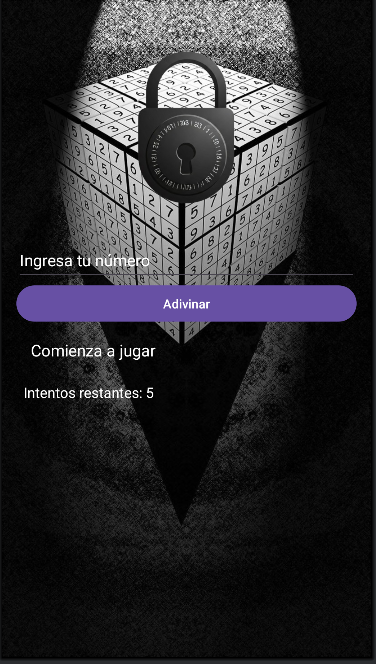

# Adivina el Número

Este es un juego simple para dispositivos Android en el que el jugador tiene que adivinar un número aleatorio generado por la aplicación. El número aleatorio está en el rango de 1 a 20 y el jugador tiene un total de 5 intentos para adivinar correctamente el número. Si el jugador adivina el número correctamente, gana. Si se queda sin intentos, pierde.

## Características

- **Rango de números**: El número a adivinar se encuentra entre 1 y 20.
- **Intentos limitados**: El jugador tiene un máximo de 5 intentos para adivinar el número.
- **Retroalimentación**: El juego proporciona mensajes de retroalimentación, como "Demasiado alto" o "Demasiado bajo", para ayudar al jugador a ajustar sus intentos.
- **Finalización del juego**: El juego se detiene cuando el jugador adivina el número correctamente o se queda sin intentos.
- **Botón de reiniciar**: Una vez terminado el juego (ganar o perder), el jugador puede reiniciar el juego con un nuevo número aleatorio y 5 intentos.

## Instrucciones

1. Al iniciar el juego, se generará un número aleatorio entre 1 y 20.
2. El jugador debe ingresar un número en el campo de texto y presionar el botón de "Adivinar".
3. Después de cada intento, la aplicación indicará si el número es demasiado alto, demasiado bajo o correcto.
4. El jugador tiene un máximo de 5 intentos para adivinar el número.
5. Si adivina el número correctamente, verá un mensaje de éxito. Si se quedan sin intentos, verá un mensaje de derrota.
6. Después de ganar o perder, el jugador puede reiniciar el juego presionando el botón "Reiniciar".

## Requisitos

- **Android Studio**: Este proyecto fue desarrollado en Android Studio.
- **Kotlin**: El lenguaje de programación utilizado es Kotlin.

## Instalación

1. Clona este repositorio en tu máquina local:
    ```bash
    git clone https://github.com/tu_usuario/adivina-el-numero.git
    ```

2. Abre el proyecto en **Android Studio**.

3. Conecta un dispositivo Android o utiliza un emulador para ejecutar la aplicación.

4. Presiona el botón **Run** (el ícono del triángulo verde) en Android Studio para iniciar el juego en tu dispositivo.

## Capturas de pantalla



## Contribuciones

Si deseas contribuir a este proyecto, siéntete libre de abrir un **issue** o hacer un **pull request**.


**¡Diviértete jugando y buena suerte adivinando el número!**
